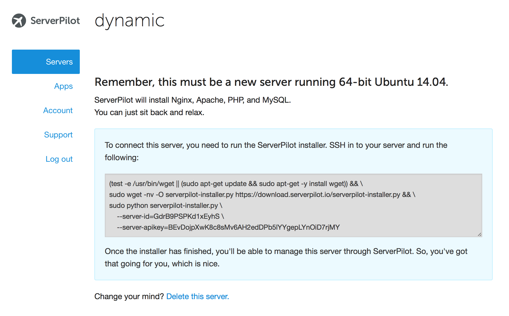
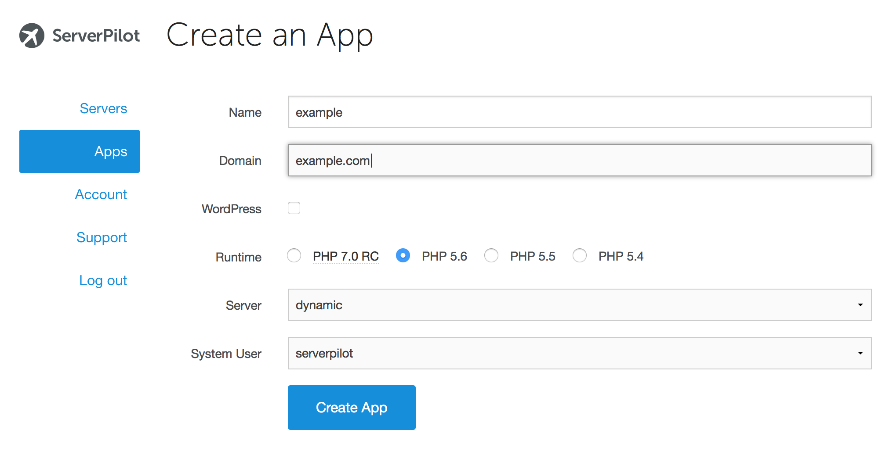
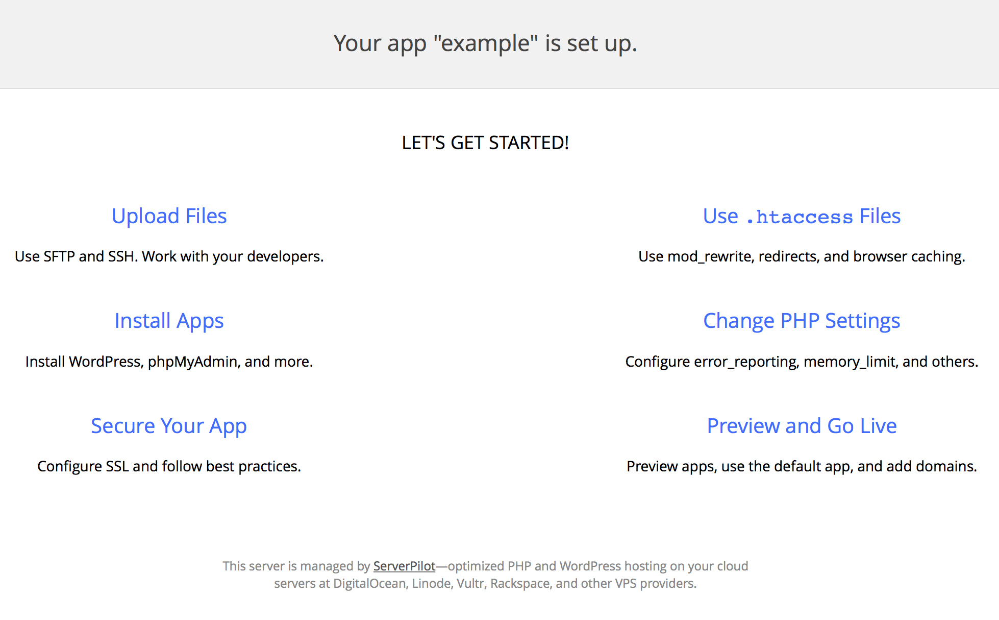
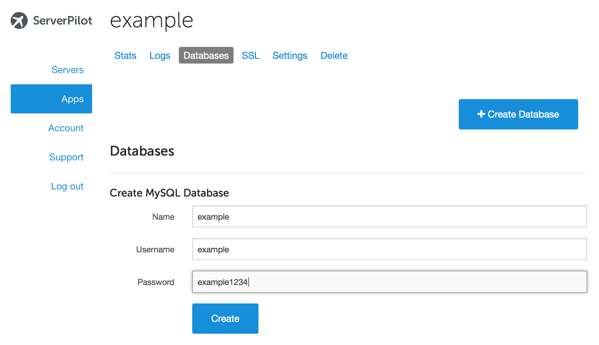
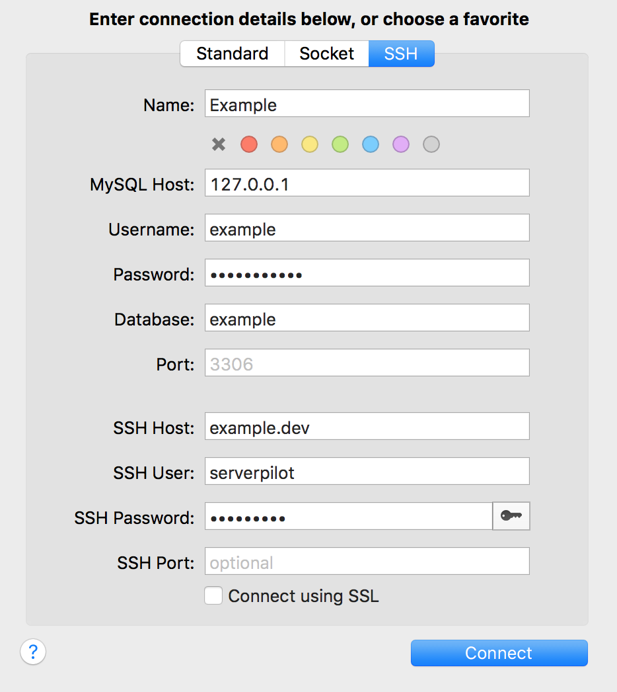
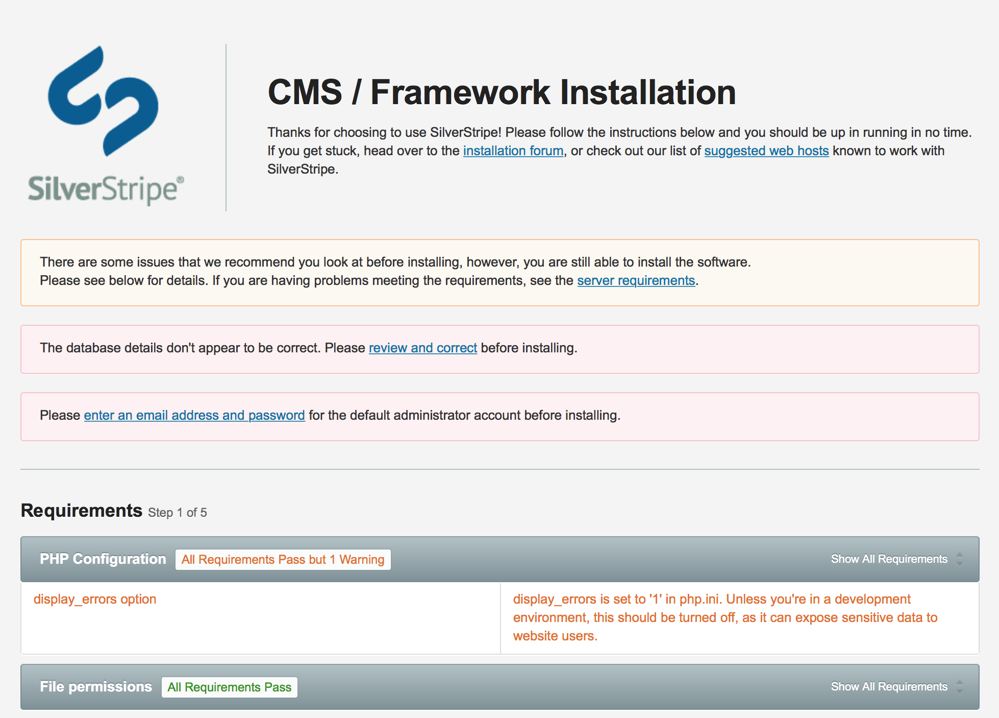

#ServerPilot Vagrantfile

This repo contains a sample Vagrantfile to get up and running with a local development environment, managed by [ServerPilot](https://serverpilot.io).

##Requirements

* Install [VirtualBox](https://www.virtualbox.org)
* Install [Vagrant](http://www.vagrantup.com)

##Getting Started

* Clone this repo: `git clone git@github.com:dynamic/serverpilot-vagrantfile.git serverpilot`
* Navigate to new directory: `cd serverpilot`
* Fire up Vagrant: `vagrant up`
* Connect via SSH: `vagrant ssh`

##Install ServerPilot

* [Log in](https://manage.serverpilot.io/#login) to ServerPilot
* Go to the *Servers* page and click **+ Connect Server**
* Near the bottom of the screen, click *Install ServerPilot manually*
* Name your server and set a SFTP password
* Copy the command provided



* Paste the command into your VM terminal to install ServerPilot
* Jump back to ServerPilot and watch the install progress

Once install is complete, you'll want to grant necessary permissions to the `serverpilot` user.

* Switch to the `root` user and add the `serverpilot` user to group `www-data`.

```
sudo -i
usermod -a -G www-data serverpilot
```

##Create an App

Once install is complete, click **+ Create App**

* Name your app (example)
* Set a domain name (example.dev)
* Choose PHP version
* Choose the server you just created (dynamic)
* Hit ***Create App***



Go to [192.168.33.10](http://192.168.33.10) in a browser and you should see the ServerPilot splash page



##Update Hosts File

To make it easier to host multiple apps on your Vagrant instance, you can update the hosts file with the domain you've set for your app.

You can manage your hosts file in a app like [GasMask](http://clockwise.ee), or manually via the Terminal.

In Terminal:

* `exit` if still connected to your Vagrant instance
* `sudo nano /etc/hosts` to open your hosts file
* At the end of your file, add `192.168.33.10	example.dev`
* Hit command-o to write, command-x to exit

In a browser, visit [example.dev](http://example.dev) and you should see the ServerPilot splash screen

##Create and Manage a Database

Since most modern php frameworks utilize databases, you'll want to create one for your project.

In your app, hit the ***Databases*** link and create a database.



ServerPilot does not provide a database management tool, but you can use any of the following tools for database management:

* [adminer](https://www.adminer.org)
* [phpmyadmin](https://www.phpmyadmin.net)
* [Sequel Pro](http://www.sequelpro.com)

Using Sequel Pro requires you to connect via SSH. Example settings are below:



##Use Composer to Create a SilverStripe App

ServerPilot is a great control panel to run most PHP website and frameworks, including WordPress, Laravel, and Drupal. For our example app, we're going to walk through creating a site in [SilverStripe](http://silverstripe.org).

* `vagrant ssh` if not connected to your Vagrant instance
* Switch to the `serverpilot` user.

```
su serverpilot
cd ~/apps/example/public
rm index.php
```

* Initialize a SilverStripe app with Composer.

```
composer5.6-sp create-project silverstripe/installer .
```

When Composer is done, refresh [http://example.dev](http://example.dev) and you should see the SilverStripe installer page.



##Root Database Access

In some cases you may need to create temporary databases for things like Unit Tests. The Database user created for an App doesn't have the ability to do this, so we instead need to use the `root` database user.

**It is strongly recomended that this is not done in a production environment**

Following these steps will allow you to access the `root` database user's password:

* Run `vagrant ssh` to login to the server
* Switch to the `root` server user with `sudo su root`
* Open the `.my.cnf` file containing the `root` password with `sudo nano /root/.my.cnf`
* Copy this information in to your project's database settings.

You should now have full database permissions with your application.

Reference: [How to Access MySQL with the MySQL Root User](https://serverpilot.io/community/articles/how-to-access-mysql-with-the-mysql-root-user.html)


##Maintainer Contact

 *  Dynamic (<dev@dynamicagency.com>)

##Links

* [ServerPilot](https://serverpilot.io)
* [VirtualBox](https://www.virtualbox.org)
* [Vagrant](http://www.vagrantup.com)
* [Dynamic](http://www.dynamicagency.com)
* [How to Access MySQL with the MySQL Root User](https://serverpilot.io/community/articles/how-to-access-mysql-with-the-mysql-root-user.html)

##License
	Copyright (c) 2015, Dynamic, Inc.
	All rights reserved.

	Redistribution and use in source and binary forms, with or without modification, are permitted provided that the following conditions are met:

	Redistributions of source code must retain the above copyright notice, this list of conditions and the following disclaimer.

	Redistributions in binary form must reproduce the above copyright notice, this list of conditions and the following disclaimer in the documentation and/or other materials provided with the distribution.

	THIS SOFTWARE IS PROVIDED BY THE COPYRIGHT HOLDERS AND CONTRIBUTORS "AS IS" AND ANY EXPRESS OR IMPLIED WARRANTIES, INCLUDING, BUT NOT LIMITED TO, THE IMPLIED WARRANTIES OF MERCHANTABILITY AND FITNESS FOR A PARTICULAR PURPOSE ARE DISCLAIMED. IN NO EVENT SHALL THE COPYRIGHT HOLDER OR CONTRIBUTORS BE LIABLE FOR ANY DIRECT, INDIRECT, INCIDENTAL, SPECIAL, EXEMPLARY, OR CONSEQUENTIAL DAMAGES (INCLUDING, BUT NOT LIMITED TO, PROCUREMENT OF SUBSTITUTE GOODS OR SERVICES; LOSS OF USE, DATA, OR PROFITS; OR BUSINESS INTERRUPTION) HOWEVER CAUSED AND ON ANY THEORY OF LIABILITY, WHETHER IN CONTRACT, STRICT LIABILITY, OR TORT (INCLUDING NEGLIGENCE OR OTHERWISE) ARISING IN ANY WAY OUT OF THE USE OF THIS SOFTWARE, EVEN IF ADVISED OF THE POSSIBILITY OF SUCH DAMAGE.